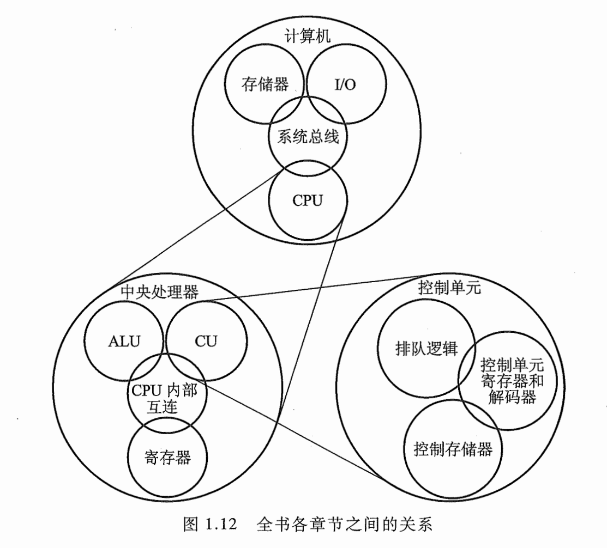
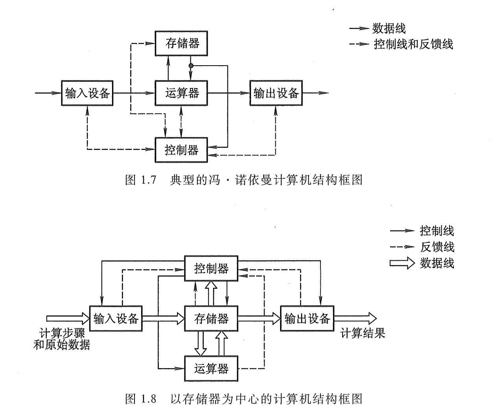
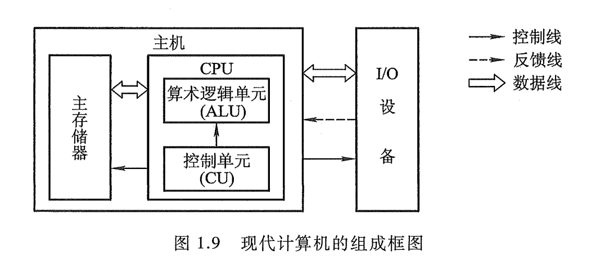
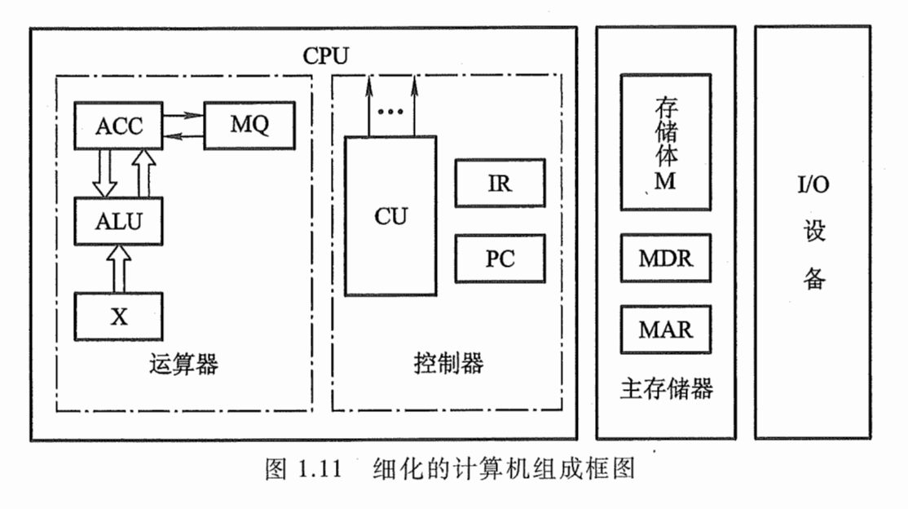

# 1.1 计算机系统概论

推荐书籍：《计算机组成与设计：软件和接口》、《数字设计和计算机体系结构》

计算机组成原理在课程体系中的作用：

- 计算机组成原理：如何实现、具体细节（知其然）
- 计算机体系结构：分析+评测（知其所以然）

## 1.1.1 计算机的软硬件

计算机系统：

- 硬件：计算机的实体，如主机、外设等
- 软件：有具有各类特殊功能的信息（程序）组成

软件：

- 系统软件：用来管理整个计算机系统（1.语言处理系统 2.操作系统 3.服务型程序 4.数据库管理系统 5.网路软件）
- 应用软件：按任务需要编制成的各种程序

## 1.1.2 计算机系统的层次结构

系统复杂性管理的方法 -- 1. 抽象：隐藏系统中不重要的细节 -- 2. 3Y：层次化Hierachy（将被设计的系统划分为多个模块或子模块）、模块化Modularity（有明确定义的功能和接口）、规则性Regularity（模块更容易被重用）

高级语言机器M4：用编译程序翻译成汇编语言程序

汇编语言机器M3：用汇编程序翻译成机器语言程序。*汇编语言没有通用性，每台机器必须有一种与之对应的汇编语言*

操作系统机器M2：用机器语言解释操作系统。*操作系统提供了在汇编语言和高级语言的使用和实现过程中所需的某些基本操作，还起到控制并管理计算机系统全部硬件和软件资源的作用*

机器语言机器M1：用微程序解释机器指令

微指令系统M0：由硬件直接执行微指令

> M2、M3、M4都是虚拟机，并不是一台实际的机器
>
> 翻译程序（将高级语言程序翻译成机器语言程序的软件）：编译程序（将高级语言程序-源程序的全部语句一次全部翻译成机器语言程序，然后再执行机器语言程序）、解释程序（将源程序的一条语句翻译成对应机器语言的一条语句，并立即执行这条语句，接着翻译源程序的下一条语句--*翻译一次执行一次，即使下一次重复执行该语句，也必须重新翻译*）

**计算机组成原理主要讨论M0和M1的组成原理和设计思想**

## 1.1.3 计算机组成与计算机体系结构

计算机体系结构：能够被程序员所见到的计算机系统的属性，即概念性的结构和功能特性（有无乘法指令）

计算机组成：如何实现计算机体系结构所体现出来的属性（如何实现乘法指令）

# 1.2 计算机的基本组成

## 1.2.1 冯·诺依曼计算机的特点

1. 计算机由运算器、存储器、控制器、输入设备和输出设备五大部件组成
2. 指令和数据以同等地位存放在存储器中，并可以按地址寻访
3. 指令和数据均用二进制数表示
4. 指令由操作码和地址码组成（操作码：表示操作的性质，地址码：表示操作数在存储器中的位置）
5. 指令在存储器内按顺序存放
6. 以运算器为中心

## 1.2.2 计算机的硬件框图

五大部件（五大子系统）功能：运算器（完成算术运算和逻辑运算，暂存运算中间结果），存储器（存放数据和程序），控制器（控制、指挥程序和数据的输入、运行以及处理运算结果），输入设备（将人们熟悉的信息形式转换成机器能识别的信息形式），输出设备（将机器运算结果转换成人们熟悉的信息形式）

中央处理器（Central Processing Unit, CPU）：集成了运算器和控制器的芯片

I/O设备（Input/Output Equipment）：输入和输出设备

现代计算机的由三大部分组成：CPU、I/O设备、主存储器（Main Memory，MM）	CPU和主存储器合起来称为主机，I/O设备又称外部设备

CPU的核心部件：算术逻辑单元（Arithmetic Logic Unit，ALU）简称算逻部件，用来完成算术逻辑运算；控制单元（Control Unit，CU）从来解释存储器中的指令，并发出操作命令来执行指令

## 1.2.3 计算机的工作步骤

1. 上机前的准备

   1.建立数学模型，2.确定计算方法，3.编制解题程序

   eg：计算$ax^2 + bx + c$（两种方法，tsf-P11）

2. 上机运行（计算机的工作过程）

   

   - 主存储器（主存或内存）

     包括主存储体M、各种逻辑部件及控制电路等。M由许多存储单元组成，每个存储单元又包括若干存储元件（存储一位二进制代码）。一个存储单元可以存储一串二进制代码，这串二进制代码为一个存储字，其位数称为存储字长。

     每个存储单元都有一个编号，称为存储单元的地址号，主存的工作方式是按存储单元的地址号来实现对存储字各位的存、取。这种存取方式为按地址存取方式（按地址访问存储器，简称访存）。由于指令和数据同等地位存储在存储器中，所以取一条指令和一个数据的操作是一样的。

     存储器地址寄存器（Memory Address Register, MAR），存放欲访问的存储单元的地址，位数对应存储单元的个数（如10位MAR，有$2^{10} = 1024$个存储单元）

     存储器数据寄存器（Memory Date Register, MDR），存放从存储体某单元取出的代码或准备往某存储单元存入的代码，其位数与存储字长相等

     早期计算机的存储字长一般和机器的指令字长与数据字长相等，一次访问主存可取一条指令或一个数据。但现在的指令字长和数据字长都是可变的。为了适应指令和数据字长的可变性，引入字节（1字节Byte等于8位bit二进制代码）来表示。

   - 运算器

     最少包括3个寄存器和一个ALU。ACC（Accumulator）为累加器，MQ（Multiplier-Quotient Register）为乘商寄存器，X为操作数寄存器。

     | 寄存器\运算 |   加法    |   减法    |     乘法      |    除法     |
     | :---------: | :-------: | :-------: | :-----------: | :---------: |
     |     ACC     | 被加数&和 | 被减数&差 |   乘积高位    | 被除数&余数 |
     |     MQ      |           |           | 乘数&乘积地位 |     商      |
     |      X      |   加数    |   减数    |    被乘数     |    除数     |

     【设：】M表示存储器的任一地址号，[M]表示对应M地址号单元中的内容；X表示X寄存器，[X]表示X寄存器中的内容；ACC表示累加器，[ACC]表示累加器中的内容；MQ表示乘商寄存器，[MQ]表示乘商寄存器中的内容。ACC已经存有前一时刻的运算结果，并作为下述运算的一个操作数：

     - 加法操作过程：[M]-> X; [ACC]+[X]->ACC
     - 减法操作过程：[M]->X; [ACC]-[X]->ACC
     - 乘法操作过程：[M]->X; [ACC]->X; 0->ACC; [X]$\times$[MQ]->ACC//MQ
     - 除法操作过程：[M]->X; [ACC]$\div$[X]->MQ; 余数R在ACC中

   - 控制器

     计算机的神经中枢，由它指挥各部件自动、协调地工作。**完成一条指令操作3个阶段：取指->分析->执行。**控制器由程序计数器(Program Counter, PC)、指令寄存器(Instruction Register, IR)以及控制单元(CU)组成。

     PC 用来存放当前欲执行指令的地址，它与主存的 MAR 之间有一条直接通路，且具有自动加1的功能，即可自动形成下一条指令的地址。IR用来存放当前的指令，IR的内容来自主存的MDR。IR中的操作码(OP(IR)送至CU记作OP(IR)->CU用来分析指令；其地址码(Ad(IR)作为操作数的地址送至存储器的MAR,记作Ad(IR)->MAR。CU用来分析当前指令所需完成的操作，并发出各种微操作命令序列，用以控制所有被控对象。

   - I/O

     各种I/O设备即相应的接口。每种I/O设备都由I/O接口与主机联系，他接受CU发出的各种控制命令，并完成相应操作

   **试着分析执行一条指令的整个流程(P16)**

# 1.3 计算机硬件的主要技术指标

## 1.3.1 机器字长

CPU一次能处理数据的位数，与CPU的寄存器位数有关

## 1.3.2 存储容量

1. 主存容量

   存储容量 = 存储单元个数 $\times$ 存储字长

2. 辅存容量

## 1.3.3 运算速度

1. 吉普森(Gibson)法：综合考虑每条指令的执行时间以及他们在全部操作中所占的百分比，$T_M = \sum_{i=1}^n{f_it_i}$，$T_M$机器运行速度，$f_i$第$i$种指令栈全部操作的百分比数，$t_i$第$i$种指令的执行时间
2. 单位时间内执行指令的平均条数：MIPS(Million Instruction Per Second，百万条指令每秒)为计量单位
3. 执行一条指令所需的时钟周期(Cycle Per Instruction, CPI)
4. FLOPS(Floating Point Operation Per Second，浮点运算次数每秒)
