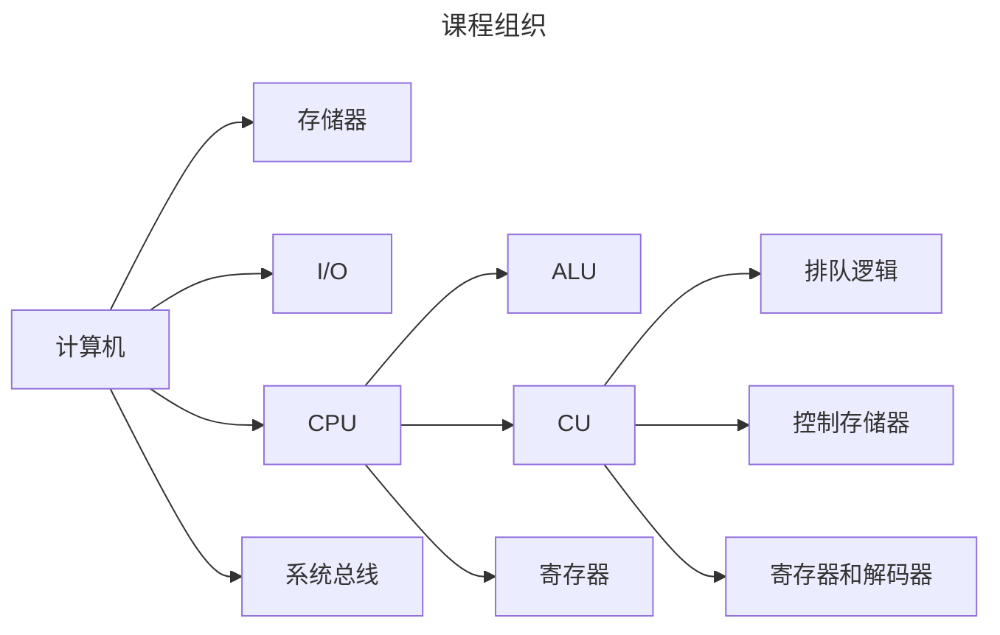

# 1.1 计算机系统概论

推荐书籍：《计算机组成与设计：软件和接口》、《数字设计和计算机体系结构》

计算机组成原理在课程体系中的作用：

- 计算机组成原理：如何实现、具体细节（知其然）
- 计算机体系结构：分析+评测（知其所以然）

## 1.1.1 计算机的软硬件

计算机系统：

- 硬件：计算机的实体，如主机、外设等
- 软件：有具有各类特殊功能的信息（程序）组成

软件：

- 系统软件：用来管理整个计算机系统（1.语言处理系统 2.操作系统 3.服务型程序 4.数据库管理系统 5.网路软件）
- 应用软件：按任务需要编制成的各种程序

## 1.1.2 计算机系统的层次结构

系统复杂性管理的方法 -- 抽象：隐藏系统中不重要的细节

高级语言机器M4：用编译程序翻译成汇编语言程序

汇编语言机器M3：用汇编程序翻译成机器语言程序。*汇编语言没有通用性，每台机器必须有一种与之对应的汇编语言*

操作系统机器M2：用机器语言解释操作系统。*操作系统提供了在汇编语言和高级语言的使用和实现过程中所需的某些基本操作，还起到控制并管理计算机系统全部硬件和软件资源的作用*

机器语言机器M1：用微程序解释机器指令

微指令系统M0：由硬件直接执行微指令

> M2、M3、M4都是虚拟机，并不是一台实际的机器
>
> 翻译程序（将高级语言程序翻译成机器语言程序的软件）：编译程序（将高级语言程序-源程序的全部语句一次全部翻译成机器语言程序，然后再执行机器语言程序）、解释程序（将源程序的一条语句翻译成对应机器语言的一条语句，并立即执行这条语句，接着翻译源程序的下一条语句--*翻译一次执行一次，即使下一次重复执行该语句，也必须重新翻译*）

**计算机组成原理主要讨论M0和M1的组成原理和设计思想**

## 1.1.3 计算机组成与计算机体系结构

计算机体系结构：能够被程序员所见到的计算机系统的属性，即概念性的结构和功能特性（有无乘法指令）

计算机组成：如何实现计算机体系结构所体现出来的属性（如何实现乘法指令）

# 1.2 计算机的基本组成

## 1.2.1 冯·诺依曼计算机的特点

1. 计算机由运算器、存储器、控制器、输入设备和输出设备五大部件组成
2. 指令和数据以同等地位存放在存储器中，并可以按地址寻访
3. 指令和数据均用二进制数表示
4. 指令由操作码和地址码组成（操作码：表示操作的性质，地址码：表示操作数在存储器中的位置）
5. 指令在存储器内按顺序存放
6. 以运算器为中心

