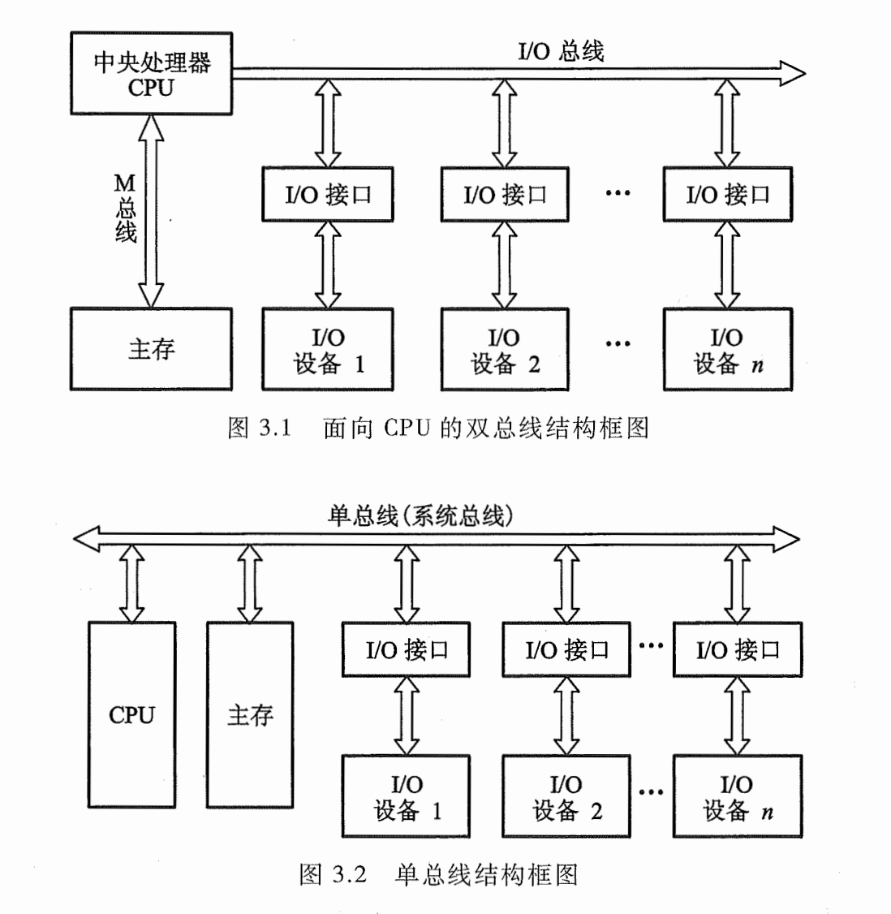
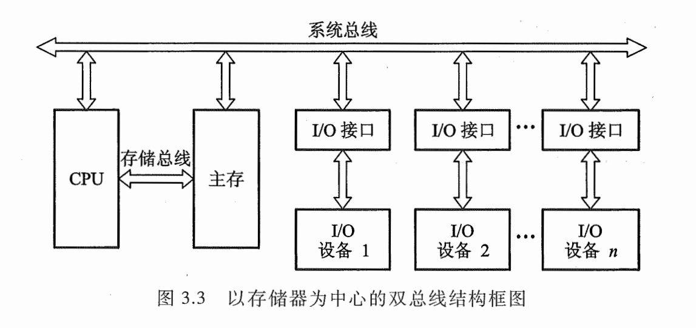

# 3.1 总线的基本概念

五大部件之间的互联方式有两种：分散连接（各部件之间使用单独的连线），总线连接（将各部件连接到一组公共信息传输线上）

总线的产生原因：为了提高I/O设备与主机之间连接的灵活性，可以随时增添或减撤设备

在某一时刻，只允许有一个部件向总线发送信息，而多个部件可以同时从总线上接收相同的信息

三种总线结构：

1. 以CPU为中心的双总线结构

   

   总线：存储总线(M总线)：连接CPU和主存 || 输入输出总线(I/O总线)：建立CPU和各I/O设备之间交换信息的通道

   缺点：I/O设备与主存交换信息时仍然需要占用CPU，影响CPU工作效率

2. 单总线结构

   I/O设备与主存交换信息时不影响CPU工作，但是，只要一组总线，当某一时刻各部件都要占用总线时会发生冲突。需要设置总线判优逻辑，让各部件按优先级高低来占用总线（会影响整机的工作速度）

3. 以存储器为中心的双总线结构

   

   在单总线基础上开辟一条CPU和主存之间的总线（存储总线）

# 3.2 总线的分类

按数据传送方式分类：并行传输总线，串行传输总线

按使用范围分类：计算机总线，测控总线，网络通信总线

**按连接部件分类：**片内总线，系统总线，通信总线

## 3.2.1 片内总线

芯片内部的总线（如CPU芯片内部，寄存器与寄存器之间，寄存器与ALU之间）

## 3.2.2 系统总线

系统总线：cup、主存、I/O设备（通过I/O接口）各大部件之间的信息传输线。由于部件常安放在主板和各个插件板上，又称板级总线或板间总线

按系统总线传输信息的不同分为：

1. 数据总线

   双向传输总线，用来传输各功能部件之间的数据信息，其位数与机器字长、存储字长有关。数据总线的位数称为数据总线宽度，是衡量系统性能的一个重要参数。（如果数据总线宽度为8位，指令字长为16位，则CPU在取指阶段必须访问两次主存

2. 地址总线

   单向传输，用来指出数据总线上的源数据或目的数据在主存单元的地址或I/O设备的地址。地址总线上的代码是用来知名CPU欲访问的存储单元或I/O端口的地址，有CPU输出。地址总线位数与存储单元个数有关（20根总线对应$2^{20}$个存储单元）

3. 控制总线

   有输入有输出（单一单向，总体双向），发出各种控制信号的传输线

## 3.2.3 通信总线

用于计算机系统之间或计算机系统与其他系统（如控制仪表、移动通信）之间的通信。

按传输方式分类：串行通信（单条1位宽的传输线，适合远距离传送），并行通信（多条并行1位宽的传输线，适合近距离传输）

# 3.3 总线特性及性能指标

## 3.3.1 总线特性

|      |      |
| ---- | ---- |
|机械特性|总线在机械连接方式上的一些性能（插头插座使用的标准、几何尺寸形状、引脚个数等）|
|电气特性|总线的每一根传输线上信号的传递方向和有效的电平范围|
|功能特性|总线中每根传输线的功能|
|时间特性|总线中的任一根线在什么时间内有效|

## 3.3.2 总线性能指标

|               |                                                              |
| ------------- | ------------------------------------------------------------ |
| 总线宽度      | 数据总线的根数（用位bit表示）                                |
| 总线带宽      | 总线的数据传输速率，单位时间内总线上传输数据的位数           |
| 时钟同步/异步 | 总线上的数据与时钟同步工作的总线称为同步总线，与时钟不同步工作的总线称为异步总线 |
| 总线复用      | 一条信号线上分时传送两种信号（如将地址总线和数据总线共用一组物理线路，在这组物理线路上分时传输地址信号和数据信号） |
| 信号线数      | 地址总线、数据总线和控制总线三种总线数的总和                 |
| 线控制方式    | 突发工作、自动配置、仲裁方式、逻辑方式、计数方式等           |
| 其他指标      | 负载能力、电源电压（是采用5V还是3.3V）、总线宽度能否扩展等   |

## 3.3.3 总线标准

