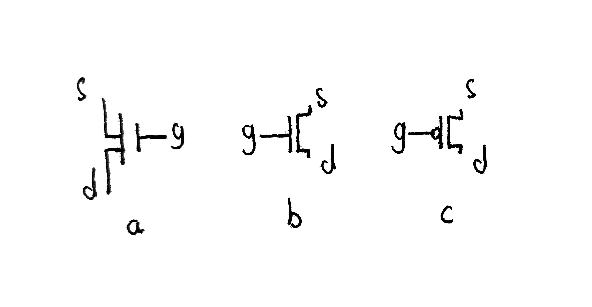
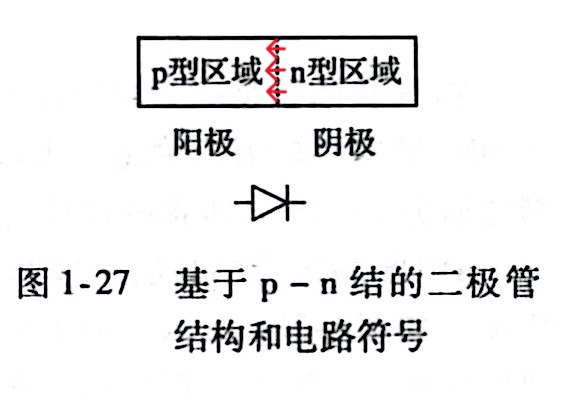
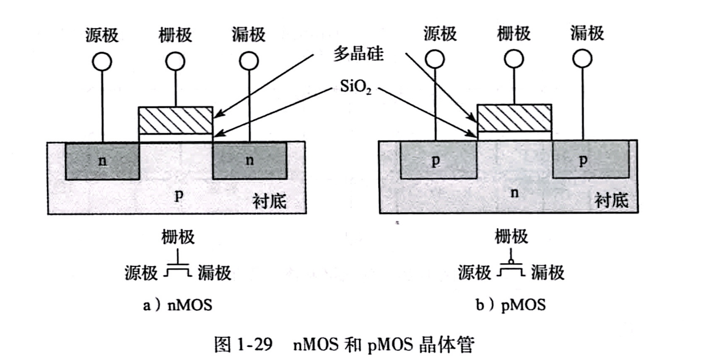
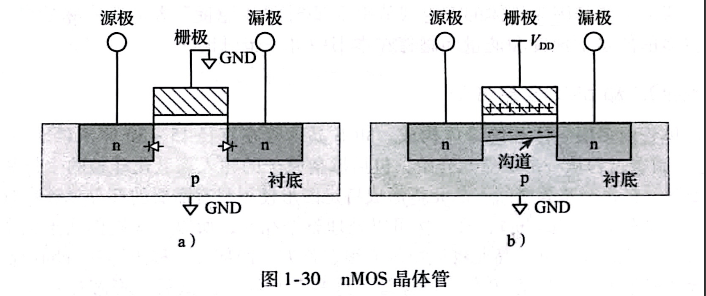
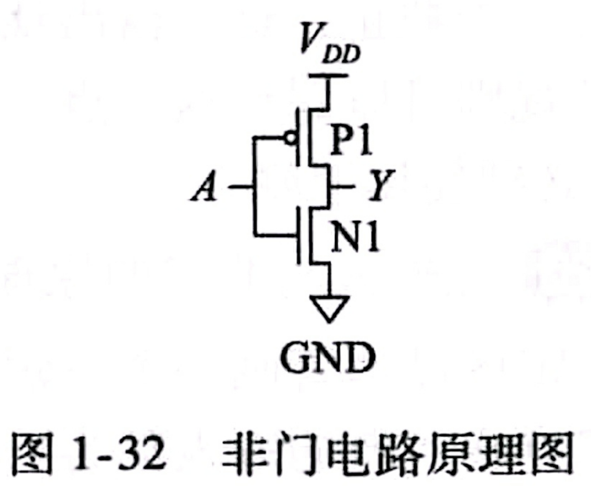

# MOS管组成的触发器

在唐朔飞的《计算机组成原理》（第三版）介绍静态RAM的基本单元电路的时候，其主要部分是一个MOS管组成的触发器，可能有很多人看到这儿就看不懂了，这篇文章对MOS管和触发器进行详细的介绍，希望对你们有帮助。

**如果你对具体的原理不感兴趣，那你只需要看这两段就可以了。**晶体管其实就是一个电子的可控开关，我们通过晶体管来实现存储“0/1代码”，MOS晶体管也是一样的。MOS管（下图a）有两种，nMOS管（下图b）和pMOS管（下图c），图中的s（源极），d（漏极），g（栅极）都是电极（接入电路的部分）。MOS管是通过g极的电压来控制s->d的电流的通断（这句话没有问题，但实际观察的是电位的高低）。nMOS管和pMOS管的区别在于**nMOS管在g极为低电平时截止，高电平时导通；pMOS管在g极为高电平时截止，低电平时导通。**

> **读完本文，你将会了解：**
>
> 1. MOS晶体管的简单原理及用途
> 2. 由MOS管组成的触发器的基本实现
>
> **前置条件：**
>
> 1. 对二极管有简单的了解
> 2. 对物质的导电原理有基础的认识

## 1. MOS晶体管

晶体管是一个电子的可控开关，当电压或电流施加到控制端时，他会在导通ON和截止OFF之间切换。晶体管有两大类：双极晶体管(bipolar junction transistor, BJT)和金属-氧化物-半导体场效应晶体管(Metal-Oxide-Semicon-ductor field effect transistor, MOSFET/MOS)

### 1.1 半导体

制作半导体最主要的元素是Si，这基本是人尽皆知的了。为什么会是硅呢？物质导电是因为有自由移动的电子，原子中自由移动的电子一般来自最外层电子。硅最外层有4个电子，这4个电子易与周围的其他硅原子的最外层电子形成4个稳定的共价键（形成一个共价键需要两个电子），形成共价键之后的电子就不能自由移动了，那硅原子周围没有自由电子可以移动了，所以硅就不导电了。但是如果对硅进行加热或者光照，即将能量传给硅，硅共价键中的电子有了能量就可以摆脱共价键的束缚，成为自由电子导电了。像硅这种我们就把他叫做半导体。OK，现在我们不加热，也不拿光照它，我们将其中的部分硅原子换成最外层有5个电子的磷，磷与周围四个硅原子形成四个共价键之后，还剩下一个电子，如果硅中有很多磷，那不就剩出来很多电子，就可以导电了，像这种因为电子很多而导电的半导体我们称为**n型半导体(negative)**。换个思路，我们把部分硅原子换成最外层有3个电子的硼，硼与周围四个硅原子形成四个共价键还差一个电子，我们可以把差电子的这个位置看做一个空位，其他地方的电子会补过来，但是，补过来的电子原本所在的位置就多出一个空位，又会从另外的地方补一个电子，这样也会造成电子的自由移动，只不过是电子被动地自由移动，我们把这个空位叫做空穴，电子补位到空穴就可以看做空穴的自由移动；如果硅中有很多的硼，那就会有很多的空穴，空穴的自由移动就可以导电了，像这种由于空穴很多而导电的半导体叫做**p型半导体(positive)**。这种掺入杂质的半导体称为非本征半导体（杂质半导体）

### 1.2 PN结（二极管）

将p型半导体和n型半导体连结到一起就构成了一个二极管，在连结部分（称为PN结），p型半导体中较多的空穴就会与n型半导体中较多的电子产生复合（带负电的电子与带正电的空穴相互抵消），于是，连结部分就没有自由移动的电子或空穴了。p型半导体失去空穴的部分带负电，n型半导体失去电子的部分带正电，由于电势差就会形成电场，称为内建电场，方向由n->p，内建电场会阻碍p区的空穴向n区移动，n区的电子向p区移动，即无法导电了。如果外加一个p->n的电场（正向偏压），将内建电场的作用削弱，电子和空穴又可以相互运动导电了。如果外加一个n->p的电场（反向偏压），内建电场的作用加强，更无法导电了。这就是二极管的单向导通性。

### 1.3 电容

电容由两块金属板构成，金属板之间夹着一层绝缘层（可以是空气，也可以是其他绝缘体）。对电容的一端加电压时，加电压的这一端就会积累正电荷，另一端会积累负电荷（此处引入电容是为了方便后面的理解，所以解释的不是很精确）

### 1.4 nMOS和pMOS晶体管

MOS晶体管由最底层的硅晶元衬底(substrate)，最顶上的的栅极(gate)，中间的二氧化硅(SiO~2~)。硅晶元衬底就是一个掺杂的半导体。栅极最开始是用金属制作的，后来为了避免金属在后续处理工艺中融化，采用多晶硅制作。与栅极相连的多晶硅与硅晶元衬底以及二者之间的二氧化硅（绝缘层）构成了一个电容。MOS晶体管有两类：n型晶体管(nMOS)和p型晶体管(pMOS)。

上图(a)为nMOS管，其衬底为p型半导体，衬底上有两个与源极(source)和漏极(drain)相连的n型掺杂区域。(b)为pMOS管，与nMOS管相反，在n型半导体衬底上构造了p型掺杂的半导体与源极和漏极相连。**注意区分二者的电路图，pMOS的上面有一个圆圈**

MOS管是一个电子的可控开关，控制端为栅极，控制源极和漏极之间的导通或截止。

MOS管的衬底一般接地（电势为零，系统中的电压最低处），我们先考虑nMOS管（如下图，GND代表接地）。如果栅极的电压为0（下图a），由于源极和漏极的电压大于0，p型衬底与两块n型掺杂之间处于反向偏压，源极和漏极之间没有电流，晶体管处于截止OFF状态。如果栅极的电压为V~DD~，电容的上表面电压为V~DD~，下表面（p衬底）电压为0，所以在下表面积累很多负电荷，使此区域从p型转变为n型，将与源极和栅极连接的两个n型区域连接起来，形成通路，电流就可以由源极流向漏极，晶体管处于导通状态。这个反转区域称为沟道(channel)。

pMOS管的工作方式正好相反。总的来说，**nMOS管在栅极为低电平时截止OFF，高电平时导通ON。pMOS管在栅极为低电平时导通ON，高电平时截止OFF。**

### 1.5 CMOS与逻辑门

结合nMOS和pMOS管，形成一种互补的结构的工艺称为**互补型MOS(complementary MOS, CMOS)。**当输入为逻辑“0”时，nMOS导通，pMOS截止；当输入为逻辑“1”时，nMOS截止，pMOS导通。这种互补的工作原理使CMOS电路具有很低的静态功耗、高的抗干扰能力和良好的噪声容限特性，因此被广泛应用于数字集成电路中，包括微处理器、存储器、逻辑门等。下面给出用CMOS晶体管构成的非门（此处只介绍非门，其余请参照《数字设计和计算机体系结构》1.7.6其他CMOS逻辑门）。

nMOS管一端接地，另一端与pMOS管一起连接输出，pMOS管的另一端接电源。两个晶体管的栅极都有输入A控制。如果A=0，则N1截止，P1导通，Y与电源V~DD~导通，为高电平（逻辑“1”）。如果A=1，则N1导通，P1截止，Y与地导通，为低电平（逻辑“0”）。输入0输出1，输入1输出0，对应非门。

## 2. 触发器

*有时间再写吧*