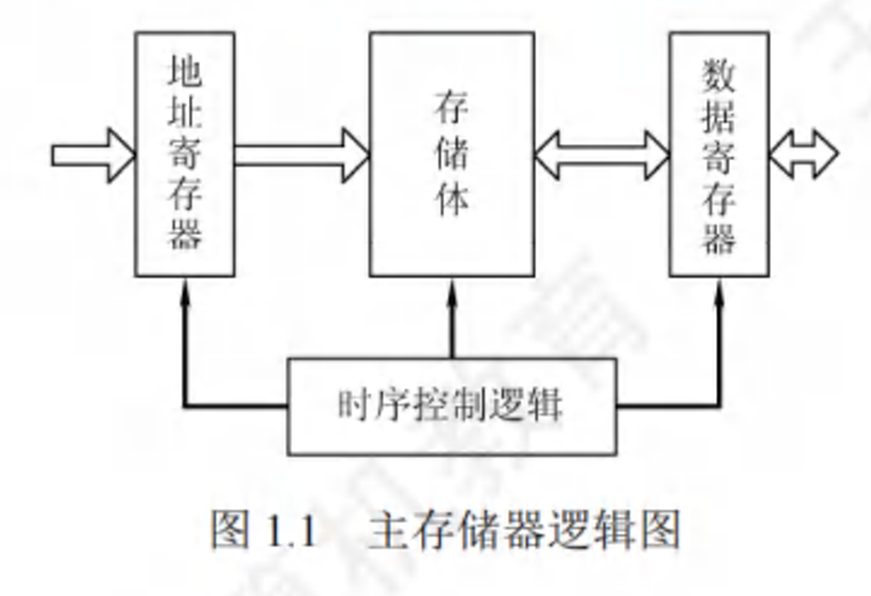

# 1.2 计算机系统层次结构

## 1.2.1 计算机系统的组成

计算机系统由硬件系统和软件系统共同构成。硬件是有形的物理设备，软件是在硬件上运行的程序和相关的数据及文档。

软/硬件在逻辑功能上是等价的（某一功能既可以通过软件来实现，也可以通过硬件来实现）。因此，在设计计算机系统时要进行软硬件的功能分配--某一功能使用较为频繁且用硬件实现的成本较为理想，则使用硬件实现可以提高效率。

## 1.2.2 计算机硬件

### 1. 冯诺依曼基本思想

冯诺依曼机（EDVAC机）的特点：

1. 采用“存储程序”的工作方式
2. 计算机硬件系统由5大部件组成
3. 指令和数据以同等的地位存储在存储器中，形式上没有区别，但计算机可以区分他们
4. 指令和数据都使用二进制代码表示
5. 指令由操作码（指明操作的类型）和地址码（指明参加运算的数在存储器中的位置）组成。
6. **以运算器为中心**

“存储程序”的基本思想：将事先编制好的程序和原始数据输入主存中才能执行，程序启动后，计算机会自动逐条执行指令，直至程序结束

### 2. 计算机的功能部件

1. 输入设备 -- 将程序和数据以计算机可以识别和接受的信息形式输入到计算机中

2. 输出设备 -- 将计算机处理的结果以人们所能接受的形式，或其他系统所要求的信息形式输出。**I/O设备是计算机与外界联系的桥梁**

3. 存储器

   + 主存

     CPU可以直接访问，工作方式为**按地址存取方式**（按存储单元的地址进行存取）

     **基本组成：**存储体M[M->存储单元（存储一串二进制代码，称为存储字，其位数为存储字长，为8的偶数倍）->存储元件（存储一位二进制代码）]；存储器地址寄存器MAR[存放欲访问的存储单元的地址，其位数为存储单元的个数（如MAR为10位，则存储单元由2^10^=1024个），MAR长度与PC长度相等]；存储器数据寄存器MDR[暂存要从存储器中读或写的信息，其位数等于存储字长]；时序控制逻辑（产生存储器操作所需的各种时序信号）

     

   + 辅助存储器

     帮助主存记忆更多的信息，辅助存储器中的信息必须跳入主存后才能被CPU所访问

4. 运算器

   进行算术运算（加减乘除）和逻辑运算（与或非、移位）

   核心是**算术逻辑单元ALU**。还有寄存器：累加器ACC、乘商寄存器MQ、操作数寄存器X、程序状态寄存器PSW（也称标志寄存器，用于存放运算得到的标志信息和处理机的状态信息，如结果是否溢出、有无进位借位、结果是否为负数等）

   |      | 加        | 减        | 乘            | 除          |
   | ---- | --------- | --------- | ------------- | ----------- |
   | ACC  | 被加数&和 | 被减数&差 | 乘积高位      | 被除数&余数 |
   | MQ   |           |           | 乘数&乘积低位 | 商          |
   | X    | 加数      | 减数      | 被乘数        | 除数        |

5. 控制器

   组成：程序计数器PC（存放当前欲执行指令的地址，与主存的MAR之间有一条直接通路，且具有自动加“1”的功能，即自动形成下一条指令的地址）；指令寄存器IR[存放当前的指令（来自MDR）]；控制单元CU