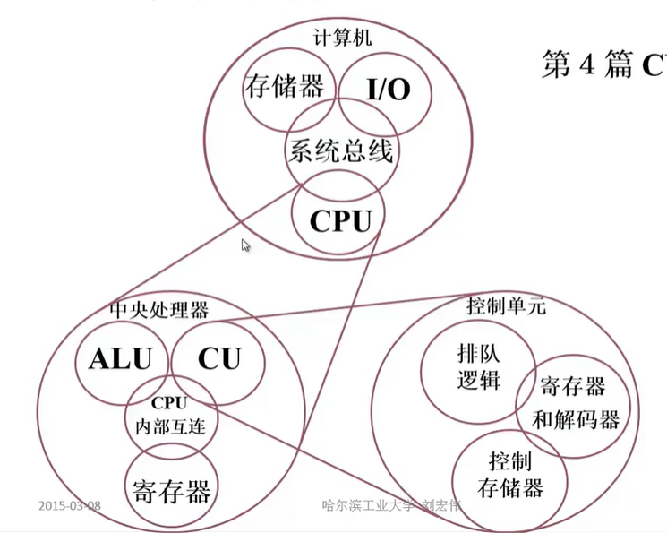
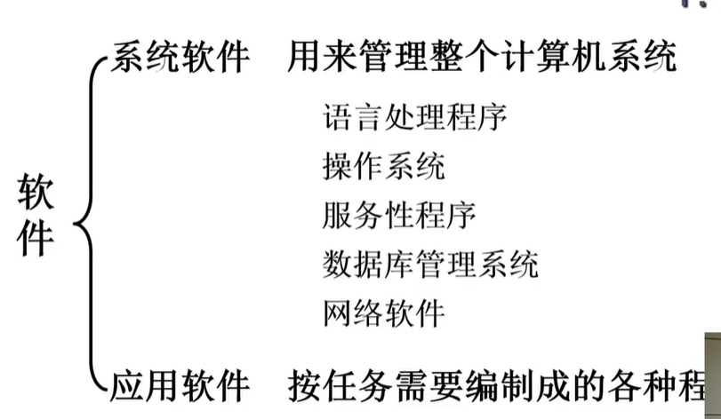

# 1.1 计算机系统简介

推荐书籍：《计算机组成与设计：软件和接口》、《数字设计和计算机体系结构》

计算机组成原理在课程体系中的作用：

- 计算机组成原理：如何实现、具体细节（知其然）
- 计算机体系结构：分析+评测（知其所以然）

课程结构：

## 1.1.1 计算机的软硬件

计算机系统：

- 硬件：计算机的实体，如主机、外设等
- 软件：有具有各类特殊功能的信息（程序）组成

软件：

## 1.1.2 计算机系统的层次结构

系统复杂性管理的方法：

1. 抽象：隐藏系统中不重要的细节